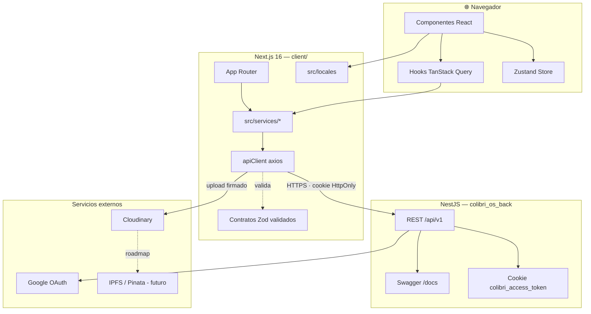

# Arquitectura

## Diagrama general



## Capas

### 1. Presentación — `src/app/` y `src/components/`

- App Router (Next.js 16), mezcla Server y Client Components.
- Reglas de layout y protección por rol: [`roles.md`](./roles.md).
- Sin llamadas HTTP directas: siempre a través de hooks o servicios.

### 2. Estado remoto — TanStack Query v5

- `src/lib/query-client.js` — configuración global con retry inteligente.
- `src/lib/query-keys.js` — todas las query keys por recurso.
- `src/hooks/queries/*` — hooks de lectura.
- `src/hooks/mutations/*` — hooks de escritura con invalidaciones.

Política de retry:

- Nunca 4xx (bad request, unauthorized, forbidden…).
- Máximo 2 reintentos.
- Backoff exponencial: 1s → 2s → 4s (tope 30s).

Ver [`../tanstack-query-migration.md`](../tanstack-query-migration.md).

### 3. Estado global UI — Zustand

- `src/lib/store.js` — store único.
- Solo para estado que **no** viene del backend (modales, filtros
  locales, preferencias de UI).

### 4. Servicios — `src/services/`

Única interfaz que usan hooks y páginas para hablar con el backend.

```js
// src/services/user.js
import { apiClient } from '@/lib/api';

export const userService = {
  profile: async () => apiClient.get('/users/profile'),
};
```

Servicios migrados: `authService`, `userService`, `projectsService`,
`evidencesService`, `nftService`. Excepción documentada:
`translationService` (usa `fetch` a una route handler interna de Next).

### 5. Cliente HTTP — `src/lib/api/`

- `client.js` — instancia axios + interceptores.
- `errors.js` — `ApiError` normalizada.
- `types.js` — códigos de error (`ERROR_CODES`).
- `token.js` — lectura de la cookie JWT.
- `requestId.js` — `x-request-id` por llamada.
- `logger.js` — logging en dev.
- `cloudinary.js` — subida de archivos (usa `fetch` por `FormData`).

Ver [`../arquitectura-capa-http.md`](../arquitectura-capa-http.md).

### 6. Contratos — `src/lib/contracts/generated/`

Schemas Zod v4 generados desde el OpenAPI del backend. Toda respuesta
se valida en runtime. Ver [`contratos.md`](./contratos.md).

### 7. i18n — `src/locales/`

Ver [`i18n.md`](./i18n.md).

## Flujo de una request (ejemplo: cargar proyectos)

```
Componente home/page.jsx
    │  useProjects()
    ▼
hook → projectsService.list()
    │
    ▼
apiClient.get('/projects')
    │
    ├─ Genera x-request-id
    ├─ Inyecta cookie colibri_access_token (vía navegador)
    ├─ Log en dev
    ▼
NestJS /api/v1/projects
    │
    ▼
Interceptor response
    ├─ 2xx → response.data
    └─ error → ApiError normalizada
         ├─ 401 → limpia sesión + callback logout
         └─ 4xx/5xx → reintento según política TanStack Query
    ▼
Zod valida el payload contra el schema generado
    ▼
Caché TanStack Query (staleTime 5 min)
```

## Decisiones arquitectónicas (ADR informal)

| Decisión | Motivo |
|---|---|
| Cliente axios único | Unificar auth, errores, trazabilidad, cancelación |
| TanStack Query sobre `useRequest` | Caché, invalidaciones, retries consistentes |
| Cookie HttpOnly en vez de localStorage | Evitar XSS; el backend maneja el ciclo de vida |
| Zod en runtime | Detectar drift FE↔BE en producción |
| Next `output: 'standalone'` (pendiente) | Reduce tamaño de imagen Docker — ver known-issues |
| No usar Kubernetes | Un solo VPS + Dokploy cubre el caso actual |

## Archivos legacy eliminados

- `src/lib/fetcher.js`
- `src/lib/axios.js`
- `src/lib/store/` (duplicado)
